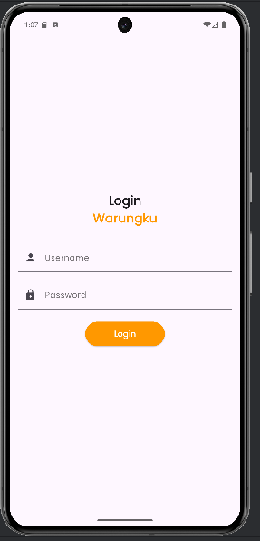
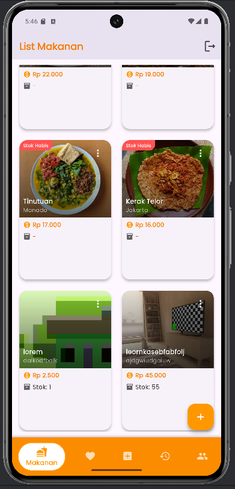
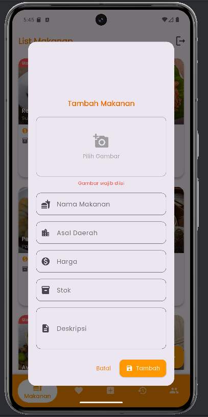
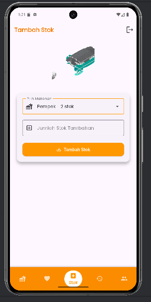
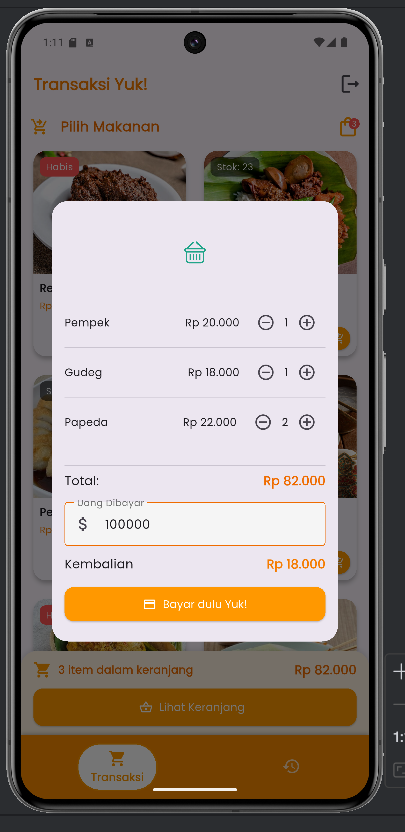
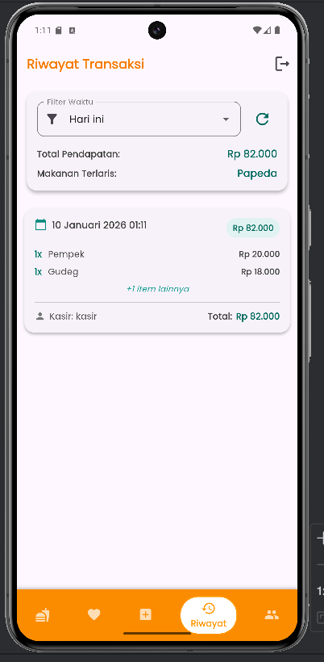
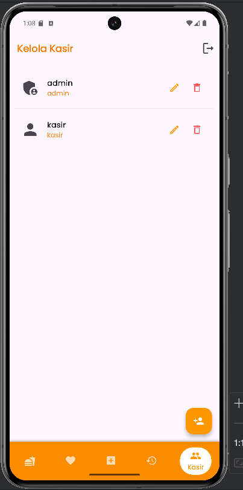
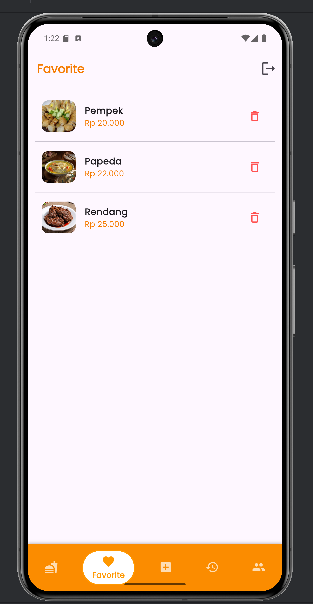

# Warungku Warung Nusantara, POS 🍜

Aplikasi Point of Sale (POS) mobile yang modern dan intuitif, dibuat dengan Flutter, untuk mengelola warung atau restoran makanan.

[](https://flutter.dev)
[](https://opensource.org/licenses/MIT)

<br>

## 📸 Screenshot Aplikasi

| Tampilan Login | Daftar Menu |
|:---:|:---:|
|  |  |
| **Tambah/Edit Menu** | **Kelola Stok** |
|  |  |
| **Halaman Kasir (Pembayaran)** | **Riwayat Transaksi** |
|  |  |
| **Manajemen Pengguna** | **Menu Favorit** |
|  |  |

---

## ✨ Fitur Utama

*   **Manajemen Menu (CRUD):** Tambah, lihat, edit, dan hapus menu makanan dengan mudah.
*   **Manajemen Stok:** Lacak dan perbarui stok makanan secara real-time.
*   **Sistem Kasir:** Proses transaksi penjualan dengan cepat dan efisien.
*   **Riwayat Transaksi:** Lihat dan kelola riwayat semua transaksi yang telah dilakukan.
*   **Manajemen Pengguna:** Kelola akun untuk peran Admin dan Kasir.
*   **Menu Favorit:** Tandai makanan favorit untuk akses yang lebih cepat.
*   **Desain Modern:** Antarmuka yang bersih dan menarik dengan tema oranye yang cerah.
*   **Penyimpanan Lokal:** Semua data disimpan secara lokal menggunakan database SQLite.

---

## 🛠️ Teknologi & Paket yang Digunakan

*   **[Flutter](https://flutter.dev/):** Framework UI untuk membangun aplikasi dari satu basis kode.
*   **[Dart](https://dart.dev/):** Bahasa pemrograman yang digunakan.
*   **[sqflite](https://pub.dev/packages/sqflite):** Database SQLite untuk penyimpanan data lokal.
*   **[google_fonts](https://pub.dev/packages/google_fonts):** Kustomisasi font dengan mudah.
*   **[lottie](https://pub.dev/packages/lottie):** Untuk animasi yang menarik.
*   **[intl](https://pub.dev/packages/intl):** Untuk format angka (harga) dan tanggal.
*   **[shared_preferences](https://pub.dev/packages/shared_preferences):** Untuk menyimpan data sesi login.

---

## 🚀 Memulai Proyek

Untuk menjalankan proyek ini di lingkungan lokal Anda, ikuti langkah-langkah berikut.

### Prasyarat

*   Pastikan Anda telah menginstal **[Flutter SDK](https://docs.flutter.dev/get-started/install)** (versi 3.x atau lebih tinggi).
*   Sebuah editor kode seperti **[Visual Studio Code](https://code.visualstudio.com/)** atau **[Android Studio](https://developer.android.com/studio)**.

### Instalasi

1.  **Clone repositori ini:**
    ```sh
    git clone https://github.com/israazwa/warungku.git
    cd warungku
    ```

2.  **Instal dependensi:**
    Jalankan perintah berikut di terminal dari root direktori proyek.
    ```sh
    flutter pub get
    ```

3.  **Jalankan aplikasi:**
    Hubungkan perangkat atau jalankan emulator, lalu jalankan perintah berikut.
    ```sh
    flutter run
    ```
    Akun default yang dibuat saat pertama kali aplikasi dijalankan adalah:
    - **Username:** `admin`
    - **Password:** `admin`

---

## 🏗️ Skema Database

Aplikasi ini menggunakan `sqflite` untuk manajemen database lokal. Berikut adalah skema tabel yang digunakan dalam format SQL yang bisa langsung disalin:

```sql
-- Tabel untuk menyimpan data makanan
CREATE TABLE makanan (
  id INTEGER PRIMARY KEY AUTOINCREMENT,
  nama TEXT,
  daerah TEXT,
  harga DOUBLE,
  stok INTEGER,
  deskripsi TEXT,
  gambar TEXT
);

-- Tabel untuk mencatat setiap transaksi
CREATE TABLE transaksi (
  id INTEGER PRIMARY KEY AUTOINCREMENT,
  tanggal TEXT,
  total DOUBLE,
  kasir_id INTEGER,
  FOREIGN KEY (kasir_id) REFERENCES users(id)
);

-- Tabel untuk detail setiap item dalam transaksi
CREATE TABLE transaksi_detail (
  id INTEGER PRIMARY KEY AUTOINCREMENT,
  transaksi_id INTEGER,
  makanan_id INTEGER,
  qty INTEGER,
  subtotal DOUBLE,
  FOREIGN KEY (transaksi_id) REFERENCES transaksi(id),
  FOREIGN KEY (makanan_id) REFERENCES makanan(id)
);

-- Tabel untuk menyimpan data pengguna (admin/kasir)
CREATE TABLE users (
  id INTEGER PRIMARY KEY AUTOINCREMENT,
  username TEXT,
  password TEXT,
  role TEXT
);

-- Tabel untuk menandai makanan favorit
CREATE TABLE favourite (
  id INTEGER PRIMARY KEY AUTOINCREMENT,
  makanan_id INTEGER UNIQUE,
  FOREIGN KEY (makanan_id) REFERENCES makanan(id)
);
```

---

##  APK/AAB untuk Testing

[Link ke folder rilis APK/AAB Anda]

---

## 📖 Dokumentasi API

Tidak ada API eksternal yang digunakan dalam proyek ini karena semua data dikelola secara lokal di dalam aplikasi menggunakan database SQLite.

---

## 📂 Struktur Proyek

```
lib/
├── components/     # Widget UI yang dapat digunakan kembali
├── databases/      # Logika helper untuk database (SQLite)
├── models/         # Kelas model untuk data (Makanan, Transaksi, dll.)
├── services/       # Layanan backend
├── utils/          # Fungsi utilitas (format angka, dll.)
├── views/          # Layar utama dan halaman aplikasi
│   ├── admin/      # Halaman khusus Admin
│   └── kasir/      # Halaman khusus Kasir
└── main.dart       # Titik masuk utama aplikasi
pubspec.yaml        # File konfigurasi dan dependensi
```
